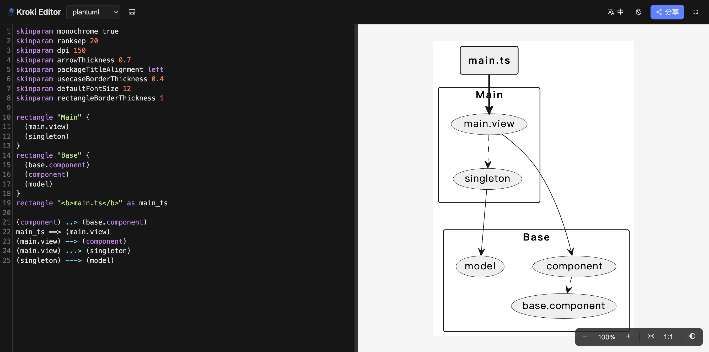
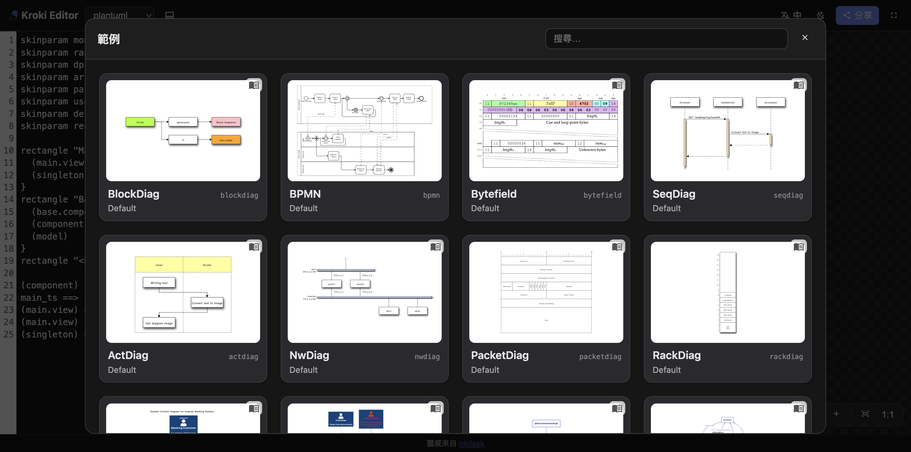

<div align="center">

# 🪁 Kroki Editor

**Write diagram-as-code, preview it live, and copy an image URL to embed anywhere — a fast, self-hostable web editor for [Kroki](https://kroki.io).**

**English** · [繁體中文](./README.zh-tw.md)

[](https://github.com/yoyoys/kroki-editor/actions/workflows/ci.yml)
[](./LICENSE)



</div>

## Why Kroki Editor?

I build a lot of diagrams at work and embed them into our documentation system. Most documentation platforms only render **Mermaid** natively — and handy as Mermaid is, it doesn't cover everything I need: more diagram types, finer layout control, the right tool for each job.

[Kroki](https://kroki.io) solves the rendering side. It turns text into ~25 diagram languages (PlantUML, GraphViz, D2, BPMN, and more) and serves each diagram as a **plain image URL**. That URL embeds into *any* docs system that accepts an image — regardless of whether the platform itself understands the diagram language.

**Kroki Editor is the authoring front-end for that workflow.** Write the source, preview it live, and copy a ready-to-embed image URL or Markdown. Point it at your own Kroki instance and you have a lightweight, self-hostable diagram studio for your docs.

## Features

- ✍️ **Live preview** — edit diagram source on the left, see it render on the right (debounced).
- 🧩 **Every Kroki diagram type** — PlantUML, Mermaid, GraphViz, D2, BPMN, and the rest. The type menu is configurable.
- 🎨 **Syntax highlighting** — Mermaid, JSON (Vega/Vega-Lite/Excalidraw/WaveDrom), XML (BPMN), YAML (WireViz), LaTeX (TikZ), SQL (DBML), plus lightweight highlighters for PlantUML, D2, GraphViz and the blockdiag family.
- 📱 **Mobile-friendly** — single-pane Edit/View toggle on small screens; draggable split on desktop.
- 🔍 **Considered zoom/pan** — `+`/`−`/Fit/1:1 buttons and drag-to-pan (no surprise scroll-zoom); pinch on touch; a fullscreen mode with a minimap.
- 🔗 **Sharing** — image URL, embed Markdown, and editable links; one-click copy with feedback, plus a quick "copy image URL" button in the toolbar.
- 🖼️ **Examples gallery** — searchable cards with live thumbnails.
- 🌗 **Light / dark theme** and a toggleable preview background (near-white / near-black).
- 🌐 **i18n** — English and Traditional Chinese, auto-detected from the browser, with a manual switch.
- ⚡ **Optional client-side Mermaid** — render Mermaid in the browser (no companion service needed).
- 📦 **Pure-frontend container** — static files served by nginx, configured at runtime via env vars, deployable under any sub-path.

## Quick start (Docker)

Pull the image from GitHub Container Registry and point it at your Kroki instance:

```sh
docker run --rm -p 8080:80 \
  -e KROKI_ENDPOINT=https://kroki.io \
  ghcr.io/yoyoys/kroki-editor:latest
```

Open <http://localhost:8080>. That's it — no build step, configuration is injected at container start.

## Configuration

The app resolves its configuration in this order: **`window.__KROKI_CONFIG__`** (injected at container start) → **`import.meta.env.VITE_*`** (build/dev) → **built-in defaults**.

### Runtime environment variables (Docker)

Injected into `config.js` at container start via `envsubst` — no rebuild needed.

| Variable | Default | Description |
|---|---|---|
| `PAGE_TITLE` | `Kroki Editor` | Browser tab title and the in-app header label. |
| `KROKI_ENDPOINT` | `https://kroki.io` | Kroki instance used to render the editor preview. |
| `EXAMPLE_KROKI_ENDPOINT` | *(falls back to `KROKI_ENDPOINT`)* | Endpoint for the Examples gallery thumbnails. Examples cover every type, so point this at a full-featured instance if your main endpoint lacks some companion services. |
| `ENABLED_DIAGRAMS` | *(all types)* | Comma-separated allow-list for the type menu, e.g. `plantuml,mermaid,d2`. Empty = all. |
| `DEFAULT_DIAGRAM` | `plantuml` | Diagram type selected on first load. |
| `MERMAID_CLIENT_SIDE` | `false` | Render Mermaid in the browser (lazy-loaded) instead of via Kroki — handy when your Kroki has no Mermaid companion. |
| `EXAMPLE_PLANTUML`, `EXAMPLE_MERMAID`, `EXAMPLE_GRAPHVIZ`, `EXAMPLE_D2` | *(built-in)* | Override the default example source for a type. The value is the diagram source **encoded** (see below). |

Example:

```sh
docker run --rm -p 8080:80 \
  -e KROKI_ENDPOINT=https://kroki.internal.example \
  -e EXAMPLE_KROKI_ENDPOINT=https://kroki.io \
  -e ENABLED_DIAGRAMS=plantuml,mermaid,graphviz,d2 \
  -e DEFAULT_DIAGRAM=plantuml \
  -e MERMAID_CLIENT_SIDE=true \
  ghcr.io/yoyoys/kroki-editor:latest
```

### Producing `EXAMPLE_<TYPE>` values

The encoded value is the diagram source compressed with zlib **deflate** then **base64url** — the same scheme Kroki uses in its URLs. A few easy ways to get one:

- Open the diagram in the editor and copy the part after `#<type>/` from the **Editable URL** in the Share dialog.
- From this repo: `pnpm encode < diagram.puml`.
- Or with no checkout, from a shell:

  ```sh
  python3 -c "import sys,zlib,base64;print(base64.urlsafe_b64encode(zlib.compress(sys.stdin.buffer.read(),9)).decode().rstrip('='))" < diagram.puml
  ```

## Syntax highlighting

CodeMirror 6 with a theme-aware palette (light/dark via CSS variables). Coverage:

| Source language | Diagram types |
|---|---|
| Mermaid | `mermaid` |
| JSON | `vega`, `vegalite`, `excalidraw`, `wavedrom` |
| XML | `bpmn` |
| YAML | `wireviz` |
| LaTeX | `tikz` |
| SQL (loose) | `dbml` |
| Built-in tokenizers | `plantuml`, `c4plantuml`, `d2`, `graphviz`, `blockdiag`/`seqdiag`/`actdiag`/`nwdiag`/`packetdiag`/`rackdiag` |

Types without a grammar (e.g. ditaa, svgbob) render as plain text.

## Client-side Mermaid

With `MERMAID_CLIENT_SIDE=true`, Mermaid diagrams are rendered directly in the browser using the [`mermaid`](https://mermaid.js.org/) library (lazy-loaded — it does not bloat the default bundle). Everything else still goes through Kroki. Useful when your self-hosted Kroki doesn't run the Mermaid companion container.

## Examples gallery

A searchable gallery of ready-made diagrams. Click a card to load it into the editor; if you have unsaved edits, it asks first.



## Deploying under a sub-path

The build uses Vite `base: './'`, so all assets are referenced relatively and the container can be served behind a reverse proxy at any path (e.g. `https://tools.example.com/kroki-editor/`).

## Development

Local setup, dev environment variables, available scripts, and how the image is built & published all live in **[DEVELOPMENT.md](./DEVELOPMENT.md)**.

## Feedback

Have a feature request, a question, or run into a problem? Please [open an Issue](https://github.com/yoyoys/kroki-editor/issues).

## Credits & License

Inspired by [niolesk](https://github.com/webgiss/niolesk) by webgiss. Diagram rendering by [Kroki](https://kroki.io). Example diagrams are sourced from niolesk.

Licensed under the [Apache License 2.0](./LICENSE).
